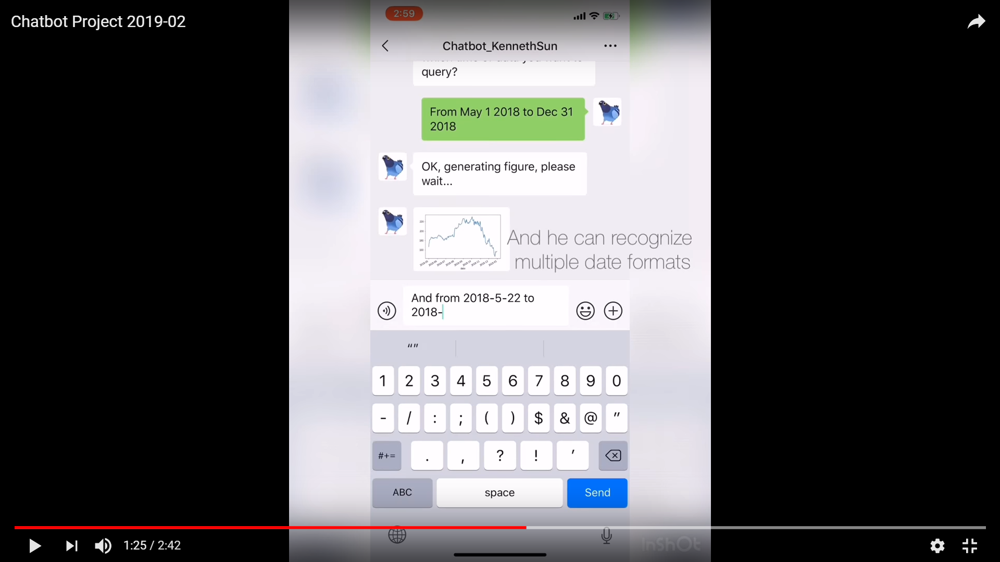

# Stock_Chatbot
This is a Chatbot project by Kenneth Sun to help clients with stock information.

## Brief video

[](https://youtu.be/beoH2ikcXqk "Everything is AWESOME")

For Mainland China users, please see ??????????
## Project report
For further information about what this project does, please see
[Chatbot_Project_Report.pdf](Chatbot_Project_Report.pdf)
# Introduction

This is a chatbot to help clients with stock information.   
With this chatbot, clients can query various stock indicators conveniently. And he can also give brief investment suggestions.  
The chatbot is associated with Wechat app via _wxpy_ API. Model training is based on  _Rasa-nlu_.   
The following techniques or methods are implemented:
- Multiple selective answers to the same question and provide a default answer.
- Intent recognition based on sklearn and spacy.
- Named entity recognition using conditional random fields.
- Construction of a local chatbot system based on _Rasa-NLU_.
- Single-round incremental query for multiple times based on the incremental filter.
- Multiple rounds of multi-query technology on state machines, and can provide explanations and answers based on contextual issues.
- Handling pending state transitions and pending actions.
- Complex pandas Dataframe processing and data cleaning, and producing a corresponding matplotlib figure.

# Example

## Identification sample

### Input: "I want to know the highest price of TSLA in the past few days"
```
# Output:
{'intent': {'name': 'vague_historical_data', 'confidence': 0.5648109407370152},
 'entities': [{'start': 19,
   'end': 26,
   'value': 'high',
   'entity': 'hst_data_type',
   'confidence': 0.7486755036905514,
   'extractor': 'ner_crf',
   'processors': ['ner_synonyms']},
  {'start': 36,
   'end': 40,
   'value': 'tsla',
   'entity': 'company',
   'confidence': 0.8320076082894126,
   'extractor': 'ner_crf'}],
 'intent_ranking': [{'name': 'vague_historical_data',
   'confidence': 0.5648109407370152},
  {'name': 'current_price', 'confidence': 0.09569968257227997},
  {'name': 'finish', 'confidence': 0.08864097295750097},
  {'name': 'advice', 'confidence': 0.06723593774902344},
 'text': 'i want to know the highest price of TSLA in the past few days'}
```
# Environment

- Python 3.4-3.6.
- Installed _iexfinance_, _wxpy_, _pandas_, _matplotlib_, _spacy_.
- Installed _Rasa-nlu_. (https://www.rasa.com/docs/nlu/installation/)

# Usage

## Intent extraction

```
interpreter.parse('I want to know the price of tesla.')
```
## Build your Wechat bot
```
from wxpy import *

# Create a new Bot object
bot = Bot()

# Set target client account
my_friend = bot.friends().search('Chatbot_KennethSun')[0]
```

## Generate line chart of stocks
```
message = 'Tell me the historical close price of TSLA from 2017-5-8 to 2017-6-8.'

generate_figure(message)
```

# Contact

Email: yzjshz1998@outlook.com  
Personal website: www.kennethsun.com
